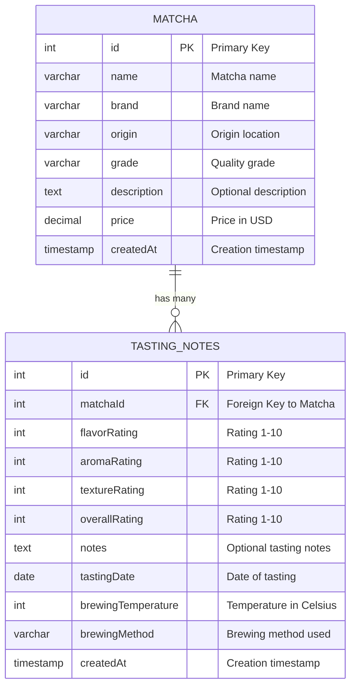

# Database Entity Relationship Diagram

## Relationship Explanation:
- **One-to-Many**: One MATCHA can have many TASTING_NOTES
- **Foreign Key**: `matchaId` in TASTING_NOTES references `id` in MATCHA
- **Cascade Delete**: When a MATCHA is deleted, all related TASTING_NOTES are deleted
